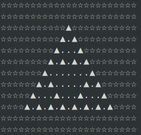
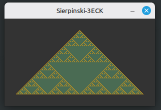

---
---
# ........ eigenständiges übungsprojekt ........
---
---
# TDD Sierpinski-Fraktal

Ein in **Rust** implementierter, testgetriebener Generator für das Sierpinski-Dreieck im Terminal. 

Das Projekt berechnet die fraktalen Strukturen rekursiv auf einem zweidimensionalen Grid. Eine Besonderheit der Implementierung ist das dynamische Spielfeld, das einen flexiblen X- und Y-Versatz (Padding) um das eigentliche Dreieck herum erlaubt.

---

## Features

* **TDD-Ansatz:** Vollständig testgetrieben entwickelt (`#[cfg(test)]` sichert die mathematischen Randfälle ab).
* **Robuste Validierung:** Das Programm fängt fehlerhafte Eingaben ab und erzwingt via `panic!`, dass die Basisgröße eine Zweierpotenz (z.B. 2, 4, 8, 16, 32...) und größer als 0 ist.
* **Erweiterter Canvas-Versatz:** Flexibler X- und Y-Offset, um das Fraktal zentriert oder verschoben innerhalb eines größeren Feldes zu zeichnen.
* **3-Zustands-Rendering:** Unterscheidung zwischen der eigentlichen Fraktal-Struktur, dem inneren Hintergrund (ausgestanzte Löcher) und dem äußeren Randbereich.

---

## Terminal-Vorschau

Wenn du das Programm ausführst, wird das Fraktal mit wunderschönen Unicode-Zeichen direkt in dein Terminal gezeichnet:

```rust
// diese werte wurden in der main dafür gesetzt
let groesse  = 8; // entspricht der Höhe bzw Anzahl der Etagen des Dreiecks
let x_offset = 4; // Außenabstand links/rechts
let y_offset = 2; // Außenabstand oben/unten
```



*(Legende: `▲` = Fraktal, `.` = Innerer Hintergrund, `☆` = Äußerer Versatzbereich)*

---

## Installation & Ausführung

Stelle sicher, dass du die aktuelle [Rust-Toolchain](https://www.rust-lang.org/) installiert hast.

```bash
# Repository klonen
git clone git@github.com:stendek55/tdd-sierpinski-fraktal.git

# In das Verzeichnis wechseln
cd tdd-sierpinski-fraktal

# Das Hauptprogramm starten
cargo run
```

### Tests ausführen (TDD)
Um die mathematischen Zusicherungen (wie den Panic-Wurf bei ungültigen Größen oder die exakten Pixel-Zustände) zu überprüfen, führe die Test-Suite aus:
```bash
cargo test
```

---

## Funktionsweise & Code-Struktur

Der Kern des Programms teilt sich in drei logische Bereiche:

### 1. Das Pixel-Zustandsmodell (`CanvasPixel`)
Das Grid arbeitet nicht mit einfachen Booleans, sondern mit einem aussagekräftigen Enum:
* `Fraktal (▲)`: Die sichtbaren Punkte des Dreiecks.
* `Hintergrund (.)`: Die mathematisch "ausgestanzten" Löcher innerhalb des Fraktals.
* `Ausserhalb (☆)`: Der dekorative Rahmenbereich, der durch den X/Y-Versatz entsteht.

### 2. Der Rekursions-Algorithmus
Die Funktion `zeichne_rekursiv` teilt das Dreieck bei jedem Schritt in drei kleinere Unterdreiecke (oben, unten links, unten rechts). 

Sobald die minimale Größe von `1` erreicht ist, wird das Pixel gesetzt. Auf dem Rückweg der Rekursion stanzt eine `for`-Schleife das umgekehrte "Negativ-Loch" präzise aus der Mitte des aktuellen Teilbereichs heraus:

### 3. Mathematische Absicherung im Test-Modul
Die Tests garantieren die mathematische Korrektheit des Fraktals (z.B. dass sich die Anzahl der gesetzten Mini-Fraktale streng nach der Formel 3^n verhält, wenn die Größe eine Zweierpotenz 2^n ist).

---
## Erweiterung des Projektes - Darstellung in Pixeln 

Das Programm generiert ein Sierpinski-Dreieck über ein softwarebasiertes Pixel-Rendering und stellt dieses in einem interaktiven Fenster mithilfe der `minifb`-Library dar. 

Die Größe bzw. der Detailgrad (Rekursionstiefe / Anzahl der Iterationspunkte) kann nun direkt beim Starten des Programms vom Benutzer selbst festgelegt werden.

### Benutzung & Parameter

Beim Ausführen des Programms muss die gewünschte Dimension / Größe (zwingend eine zweierPotenz) angegeben werden.
Danach erfolgt die Auswahl der Darstellungsform - entweder mit chars auf der Konsole oder einzelnen Pixeln in einem extra Fenster.

```bash
Größe eingeben -> muss Zweierpotenz sein (2, 4, 8, 16, ...):
128
Darstellung Ausgeben als Zeichen auf [K]onsole oder mit Pixeln im [F]enster?
f
```

* **Pixelgenaues Zeichnen:** Das Fraktal wird mittels Rekursion berechnet und Pixel für Pixel direkt in den `minifb`-Framebuffer geschrieben.
* **Dynamische Fensteranpassung:** Die Fenstergröße von `minifb` skaliert automatisch mit der vom Benutzer gewählten Dreiecksgröße.

### Rendering-Beispiel

So sieht die Ausgabe des pixelbasierten Sierpinski-Dreiecks in einem Standard-Anwendungsfenster mit Größe 128 aus:




---
## Effektives Arbeiten & Tipps

Ich Arbeite auf der Konsole mit **tmux** um mehrere Fenster gleichzeitig offen zu haben und zwischen diesen schnell springen zu können.  

3 offene Fenster:
* nvim: zum schreiben von Code
* cargo: zum Ausführen von Code
* git: zur Code-Verwaltung  

Über plugins kann man sich in **nvim** eine gute Intellisence bauen. Außerdem sollte man **cargo-watch** installieren, dadurch wird bei jedem speichern der Code compiliert und ausgeführt.

```bash
# bei jedem speichern wird das Fraktal neu gezeichnet
cargo watch -x run

# beim speichern wird die Test-Suite sofort automatisch durchlaufen
cargo watch -x test

# beim speichern werden erst die Tests geprüft

# wenn alle Tests Grün sind wird das Fraktal gezeichnet
cargo watch -x test -x run
```
---

## Hinweis zu meinen Commits
***Meine Commit-History ist am Anfang etwas verdreht. Da ich das Repository zu Beginn auf einem USB-Stick gehalten hatte, um an verschiedenen Arbeitsplätzen daran entwickeln zu können. Dabei habe ich nicht bemerkt, dass an einer Maschine die Systemzeit unkorrekt war, dadurch ist die Reihenfolge leicht durcheinander. Wurde mir selbst erst offensichtlich als ich das lokale Repo auf GitHub geladen habe.***
